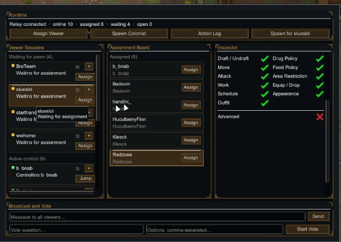

# Overlord

Twitch viewers control your RimWorld colonists from a browser.

Assign a colonist to a viewer and they get a live control panel: needs, health, skills, map view, draft/move/work/gear, and (optionally) a Twitch Toolkit store in the same window.

**RimWorld 1.5 / 1.6** · requires **[Harmony](https://github.com/pardeike/HarmonyRimWorld)**

**You do not need Twitch, and you do not need to be streaming.** Overlord runs in two modes:

- **Local / friends mode** — no Twitch, no relay, no stream. Friends open a link on your network and type any name. See [Play with friends](#play-with-friends-no-twitch-no-streaming) or the full **[Hosting guide](docs/HOSTING_GUIDE.md)**.
- **Twitch / stream mode** — viewers log in with Twitch through a relay you host. There is no shared public server; each streamer runs their own relay. Start with the **[Hosting guide](docs/HOSTING_GUIDE.md)**.

### Deploy your own relay

[](https://railway.app/new/template?template=https%3A%2F%2Fgithub.com%2Fscheissgeist%2FOverlord&rootDirectory=relay-server&envs=HOST_SECRET%2CTWITCH_CLIENT_ID)
[](https://render.com/deploy?repo=https://github.com/scheissgeist/Overlord)

The relay runs **under your own account**, so the bill (usually $0 on a free tier)
is yours and never someone else's. You will be asked for two values:

| Variable | Where it comes from |
|---|---|
| `HOST_SECRET` | Mod Settings → Overlord → **Generate**, then copy |
| `TWITCH_CLIENT_ID` | [Twitch Developer Console](https://dev.twitch.tv/console/apps) → your app |

Prefer the CLI, or want Fly.io / Docker? See **[docs/SELF_HOST.md](docs/SELF_HOST.md)**.



*In-game Overlord tab: assign viewers, manage colonists, and set permissions.*

---

## How it fits together

```
Viewers (browser + Twitch login)
        │
        ▼
  Your relay server  ◄── RimWorld host (Overlord mod)
        │
        └── optional: Twitch Toolkit / ToolkitUtils for Buy / Story purchases
```

- **Mod** — runs in RimWorld; sends pawn/map state; applies viewer commands.
- **Relay** — Node server (Fly.io, Docker, or local). One host connection per instance.
- **Viewers** — open your relay URL, log in with Twitch, claim or wait for assignment.

Native pawn control (draft, move, work, gear) is Overlord. Toolkit **Buy** still needs Toolkit loaded and its Twitch chat client connected in RimWorld.

---

## Play with friends (no Twitch, no streaming)

Overlord does not require Twitch or a relay. In **local mode** the mod serves the
viewer UI itself, straight from your game.

1. In **Mod Settings → Overlord**, leave **Relay Server URL blank**.
2. Note the **Local server port** (default `8421`).
3. Start or load a save.
4. Friends open `http://<your-computer's-LAN-IP>:8421` in a browser.
5. They type any name — no Twitch login — and claim a colonist.

That's it. No relay to deploy, no Twitch application, no host secret, and nothing
has to be broadcast anywhere.

**Playing with friends outside your network?** The mod only serves your local
network. To reach remote friends, either forward the port on your router or use a
tunnel (Tailscale, `cloudflared`, ngrok) and hand them that address instead.

**If only your own machine can connect,** RimWorld could not bind all network
interfaces and fell back to localhost-only. Run RimWorld as administrator and
check the log — it states which one happened.

---

## Install

### From Steam Workshop

1. Subscribe: [Overlord on Steam Workshop](https://steamcommunity.com/sharedfiles/filedetails/?id=3760983440)
2. Also subscribe to **[Harmony](https://steamcommunity.com/workshop/filedetails/?id=2009463077)** (or install Harmony another way).
3. Enable **Harmony**, then **Overlord**, in the RimWorld mod list.
4. Deploy **your own relay** — Workshop does not include a shared server. See **[docs/SELF_HOST.md](docs/SELF_HOST.md)**.

### From a GitHub Release

1. Download the latest **Release** zip.
2. Unzip into `RimWorld/Mods/Overlord`.
3. Enable **Harmony**, then **Overlord**.
4. Deploy your own relay — see **[docs/SELF_HOST.md](docs/SELF_HOST.md)**.

### From source

```bat
build.bat
```

Or `dotnet build Overlord.csproj -c Release`. Close RimWorld before replacing the DLL.

Then follow **[docs/SELF_HOST.md](docs/SELF_HOST.md)** for the relay, Twitch app, and mod settings.

---

## Relay (short)

```bat
cd relay-server
npm install
set HOST_SECRET=choose-a-long-random-string
set TWITCH_CLIENT_ID=your-twitch-client-id
npm start
```

Full Fly.io / Docker / troubleshooting: **[docs/SELF_HOST.md](docs/SELF_HOST.md)**.

In RimWorld → Mod Settings → **Overlord**, set:

- **Relay Server URL** — your relay base (e.g. `https://YOUR-APP.fly.dev`)
- **Host secret** — same as `HOST_SECRET`

Send viewers your relay’s public HTTPS URL (never the host secret).

---

## Optional: Twitch Toolkit

If you use Twitch Toolkit / ToolkitUtils:

- Overlord **Buy** / **Story** use the Toolkit store bridge.
- Toolkit’s Twitch chat client must be connected in-game or purchases stay locked.
- Pawn-targeted store SKUs (healme, traits, etc.) apply to the **Overlord-assigned** colonist when bought from Overlord.

---

## Acknowledgements

Overlord is inspired by **[Puppeteer](https://github.com/pardeike/Puppeteer)** by **Andreas Pardeike (Brrainz)** — the original RimWorld mod that let Twitch viewers control colonists from a browser. Overlord is a new codebase aimed at RimWorld 1.5/1.6 and self-hosted relays; it is not affiliated with or maintained by the Puppeteer authors.

Harmony is by the same author: [HarmonyRimWorld](https://github.com/pardeike/HarmonyRimWorld).

---

## Feedback

Questions, bugs, and ideas: [broteampill@gmail.com](mailto:broteampill@gmail.com) · or open a GitHub issue on this repo.

---

## License

MIT — see [LICENSE](LICENSE).
